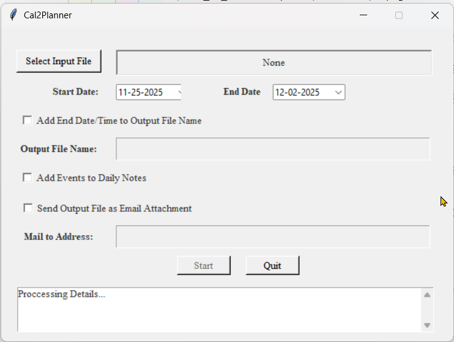
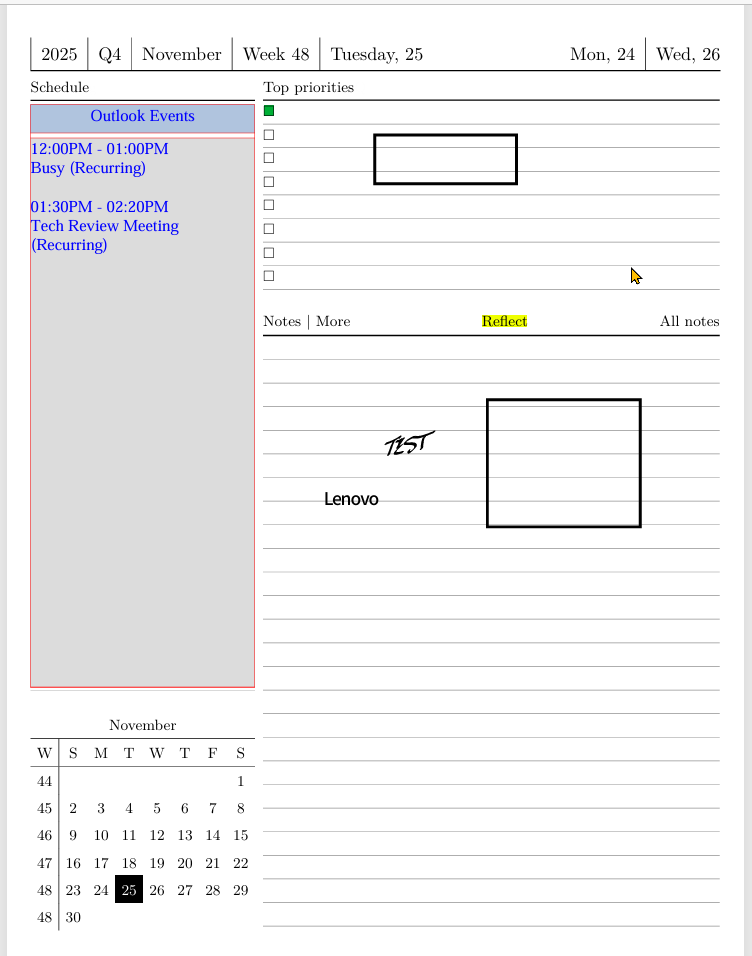

# cal2plannerpdf

## Overview

`cal2plannerpdf` is a Python script that retrieves calendar events / appointments from Outlook using the `win32com.client` and adds the calendar events to a PDF based Planner file on the appropriate Daily Planner page for each of the event days retrieved.

This script is specifically designed to augment the spectacular work done here:
[kudrykv/latex-yearly-planner: Digital planner for Supernote and ReMarkable](https://github.com/kudrykv/latex-yearly-planner)

The script creates a GUI front-end using the python tkinter libraryand allows you to:

* Select the PDF Planner file to update
* Select the begin and end date of calendar events to retrieve
* Define the output file name and wether or not it will be named based upon the end date selected
* Optionally add the events retrieved to the `Notes` page associated with the Daily Planner day
* Optionally send updated PDF Planner file as an Email Attachment and define the email recipient address

  New in v.1.1.0
* Creates a settings.ini file containing relevant values selected within the GUI
* settings.ini "numberofdays" calculated by difference between start and end date selected
* Read and Imports relevent values from settings.ini if exists
* --autostart parameter added which if supplied on command line automatically runs script using imported values from settings.ini
* changed Pymupdf calls from shape.insert_textbox to page.insert_htmlbox for increased flexibilty



## Planner PDF File - Notes

The script was created to specifically work with the PDF Planner files located at the following Link:
[pdf calendar download link](https://github.com/kudrykv/latex-yearly-planner/discussions/8)

Shown below are some sample images of the updated `Daily Planner` page and the optionally updated linked Daily Planner `Notes` page:

Updated Daily Planner Page



Updated Daly Planner Notes Page


## E-Reader Device - Notes

The cal2plannerpdf.py script has been tested against the planner files created for the `SuperNote ax5` and the  `Remarkable2`.  The script will likely work against the Planner files created for other devices, but this has not specifically been tested.

When I originally created the script, I had a `Amazon Kindle Scribe`, and the script worked relatively well. Hence the option to send the modified PDF Planner file to an email address like `Send-To-Kindle <username@kindle.com>`.  This enabled the ability to use Amazon Send-To-Kindle functionality to send the modified PDF Planner file to the kindle device. It should be noted that the Kindle Scribe export functionality breaks the page-to-page embeded hyperlink within the PDF Planner file.  Not sure whether Amazon has ever addressed this problem as I no long use the Kindle Scribe.

The E-Reader device that I am currently using is a `Boox Note Air 4c` and it works really well with the PDF Planner files.  Specifically the `SuperNote ax5` based Planner files work best for this device.  It should be noted that <u>when opening and editing the Planner files, you should specifically use the `Boox NeoReader`application and NOT the`Boox Notes` application</u>.  The Boox Notes application has the same issue as the Kindle Scribe, where it breaks the embedded page-to-page hyperlinks which serverely limits the functionality of the Planner Files.  The NeoReader application from my experience so far has all the same functionality as the Notes application, maybe more, and does not break the embedded hyperlinks.

### Synchronzing the updated PDF Planner File

Since the Boox Note Air 4c is an Android device at heart, I am able to utilize the awesome `Syncthing` application installed on both the Windows machine and The Boox Note Air 4c tablet. The modifications to the planner PDF files are synchronized between devices nearly immediately after saving on either device.

Again, when using the Kindle Scribe, I used the "Send-To-Kindle" functionality to get the modified file from the Windows device to the Kindle Device, but it was not without its problems (see above).

## Prerequisites

Before running the script, make sure you have the following dependencies installed:

* Microsoft Windows with the Micrsoft Outlook email client installed
* Python 3.x
* PyMuPDF
* pypiwin32
* tkcalendar

## Usage

To use the script, follow these steps:

1. Clone the repository and change directory to the repository folder.
2. Optionally create and activate a python virtual environment.

   ```shell
   python -m venv .venv
   .\.venv\Scripts\activate.ps1
   ```

3. Install the required dependencies ).

   ```shell
   pip3 install -r ./requirements.txt
   ```

4. Run the script with the following command:

   ```shell
   python cal2plannerpdf.py
   ```
